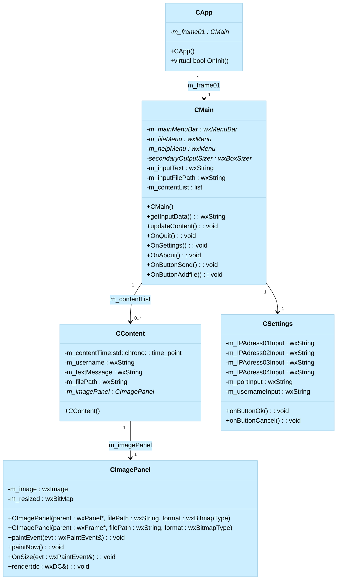

```mermaid
    %%{init: {'theme':'base', 'themeVariables': { 'primaryColor': '#cceeff', 'classText': '#000' }
    }}%%
    classDiagram
        class CApp {
        -m_frame01 : CMain*
        +CApp()
        +virtual bool OnInit()
        }

        class CMain {
        -m_mainMenuBar : wxMenuBar*
        -m_fileMenu : wxMenu*
        -m_helpMenu : wxMenu*
        -secondaryOutputSizer : wxBoxSizer*
        -m_inputText : wxString
        -m_inputFilePath : wxString
        -m_contentList : list<CContent*>
        +CMain()
        +getInputData() : wxString
        +updateContent() : void
        +OnQuit() : void
        +OnSettings() : void
        +OnAbout() : void
        +OnButtonSend() : void
        +OnButtonAddfile() : void
        }

        class CContent {
        -m_contentTime:std::chrono: : time_point<std::chrono::system_clock>
        -m_username : wxString
        -m_textMessage : wxString
        -m_filePath : wxString
        -m_imagePanel : CImagePanel*
        +CContent()
        }

        class CImagePanel {
        -m_image : wxImage
        -m_resized : wxBitMap
        +CImagePanel(parent : wxPanel*, filePath : wxString, format : wxBitmapType)
        +CImagePanel(parent : wxFrame*, filePath : wxString, format : wxBitmapType)
        +paintEvent(evt : wxPaintEvent&) : void
        +paintNow() : void
        +OnSize(evt : wxPaintEvent&) : void
        +render(dc : wxDC&) : void
        }

        class CSettings {
        -m_IPAdress01Input : wxString
        -m_IPAdress02Input : wxString
        -m_IPAdress03Input : wxString
        -m_IPAdress04Input : wxString
        -m_portInput : wxString
        -m_usernameInput : wxString
        +onButtonOk() : void
        +onButtonCancel() : void
        }

        CApp "1" --> "1" CMain : m_frame01
        CMain "1" --> "1" CSettings
        CMain "1" --> "0..*" CContent : m_contentList
        CContent "1" --> "1" CImagePanel : m_imagePanel
```
