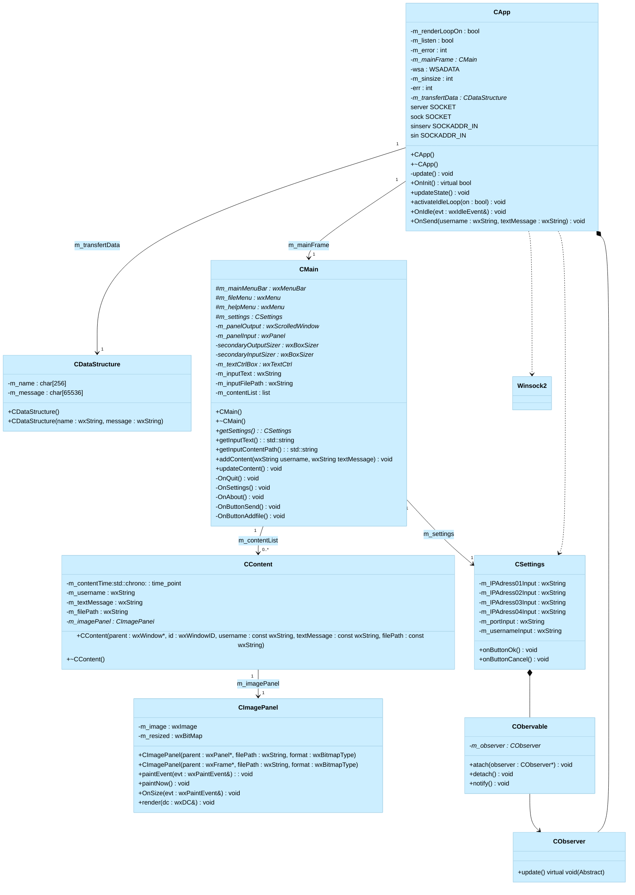

```mermaid
    %%{init: {'theme':'base', 'themeVariables': { 'primaryColor': '#cceeff', 'classText': '#000' }
    }}%%
    classDiagram
		class CApp {
			-m_renderLoopOn : bool
			-m_listen : bool
			-m_error : int
			-m_mainFrame : CMain*
			-wsa : WSADATA
			-m_sinsize : int
			-err : int
			-m_transfertData : CDataStructure*
			server SOCKET
			sock SOCKET
			sinserv SOCKADDR_IN
			sin SOCKADDR_IN

			+CApp()
			+~CApp()
			-update() void
			+OnInit() virtual bool
			+updateState() void
			+activateIdleLoop(on : bool) void
			+OnIdle(evt : wxIdleEvent&) void
			+OnSend(username : wxString, textMessage : wxString) void
		}
		
		class CDataStructure {
			-m_name : char[256]
			-m_message : char[65536]
			
			+CDataStructure()
			+CDataStructure(name : wxString, message : wxString)
		}

		class CMain {
			#m_mainMenuBar : wxMenuBar*
			#m_fileMenu : wxMenu*
			#m_helpMenu : wxMenu*
			#m_settings : CSettings*
			
			-m_panelOutput : wxScrolledWindow*
			-m_panelInput : wxPanel*
			
			-secondaryOutputSizer : wxBoxSizer*
			-secondaryInputSizer : wxBoxSizer*
			
			-m_textCtrlBox : wxTextCtrl* 
			
			-m_inputText : wxString
			-m_inputFilePath : wxString
			-m_contentList : list<CContent*>

			+CMain()
			+~CMain()
			
			+getSettings() : CSettings*
			+getInputText() : std::string
			+getInputContentPath() : std::string
			
			+addContent(wxString username, wxString textMessage) void
			+updateContent() void
			
			-OnQuit() void
			-OnSettings() void
			-OnAbout() void
			
			-OnButtonSend() void
			-OnButtonAddfile() void
		}

		class CContent {
			-m_contentTime:std::chrono: : time_point<std::chrono::system_clock>
			-m_username : wxString
			-m_textMessage : wxString
			-m_filePath : wxString
			-m_imagePanel : CImagePanel*
			
			+CContent(parent : wxWindow*, id : wxWindowID, username : const wxString, textMessage : const wxString, filePath : const wxString)
			+~CContent()
		}

		class CImagePanel {
			-m_image : wxImage
			-m_resized : wxBitMap
			
			+CImagePanel(parent : wxPanel*, filePath : wxString, format : wxBitmapType)
			+CImagePanel(parent : wxFrame*, filePath : wxString, format : wxBitmapType)
			+paintEvent(evt : wxPaintEvent&) : void
			+paintNow() void
			+OnSize(evt : wxPaintEvent&) void
			+render(dc : wxDC&) void
		}

		class CSettings {
			-m_IPAdress01Input : wxString
			-m_IPAdress02Input : wxString
			-m_IPAdress03Input : wxString
			-m_IPAdress04Input : wxString
			-m_portInput : wxString
			-m_usernameInput : wxString
			
			+onButtonOk() void
			+onButtonCancel() void
		}
		
		class CObervable {
			-m_observer : CObserver*
			
			+atach(observer : CObserver*) void
			+detach() void
			+notify() void
		}
		
		class CObserver {
			+update() virtual void (Abstract)
		}

		CApp "1" --> "1" CMain : m_mainFrame
		CApp "1" --> "1" CDataStructure : m_transfertData
		CApp *-- CObserver
		CApp ..> CSettings
		CApp ..> Winsock2
		CMain "1" --> "1" CSettings : m_settings
		CSettings *-- CObervable
		CObervable --> CObserver
		CMain "1" --> "0..*" CContent : m_contentList
		CContent "1" --> "1" CImagePanel : m_imagePanel
```
